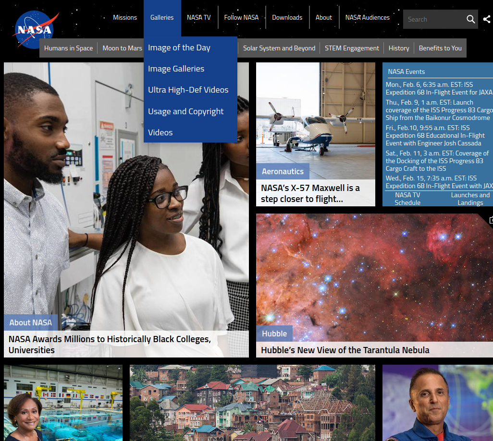

# **Laboration 1 - HTML & CSS - INDIVIDUELL UPPGIFT**

## **Del 1 (G)**

Du skapa en enklare kopia av NASA's hemsida (du kommer få ett INDIVIDUELLT repository tilldelat via github classroom), så här ser den ut:
<!-- Add an image in markdown -->

Gå in på nasas hemsida för att se hela sidan.

- Bilderna behöver inte vara samma, använd vilka som helst
- Försök att inte ta hjälp av källkoden på deras hemsida, vi lär oss bäst genom att försöka själv. Du skjuter dig själv i foten varje gång du kollar på facit. 
- Använd CSS grid för att jobba med rutnätet av bilder
- Använd Flexbox när du gör navbar / headers
- Du ska skapa fungerande dropdowns med endast CSS likt bilden när man håller musen över "Galleries". Tips: Använd css-propertyn "display" för att dölja en osynlig lista som visar sig när du håller musen över länken. Kombinera detta med propertyn "position".
- Glöm inte searchbaren längst uppe till höger. För ikoner bör du använda SVG-filer.
- Använd en snygg textfont, tex. Roboto, MS Trebuchet eller dylikt.

Tips: 1. Börja med rutnätet 2. Skapa navbaren. 3. Skapa footern 4. Skapa dropdown & searchbar.

## **Del 2** - Styling Frameworks (VG)

Försök att göra ett rough återskapande av del 1 fast med ett annat designtema, använd istället något av följande stylingramverk:

- Bootstrap https://getbootstrap.com/docs/5.3/getting-started/introduction/ - Väldigt populärt för några år sedan (twitters egna designramverk), har en tydlig stil.
- Material https://m2.material.io/develop/web/getting-started - Följer googles designspecifikationer för materiell design
- Tailwind CSS https://tailwindcss.com/ - Mindre fokus på en viss "stil", blivit mycket populärt på senare tid
- Bulma https://bulma.io/documentation/overview/start/ - Ett hyffsat populärt alternativ bland många mindre hemsidor

Varje ramverk kommer ge en annorlunda designkänsla - det är därför 100% OK att den inte exakt ser ut som originalet!

Bootstrap, Material och Tailwind CSS används oerhört frekvent bland företag, det är alltid en kort inlärningskurva som följs av en 2-3x förbättring i produktivitet. Kan rekommenderas STARKT att lära sig någon av dessa inför större projekt!

Har du en egen idé för en hemsida du skulle vilja "kopiera", fråga läraren!

## Om inlämningen
- Den är individuell, det är dock OK att diskutera med andra elever. Att kopiera varandras kod är dock förbjudet, jag märker direkt om två personers kod ser liknande ut. Tro inte att jag inte märker, ok?
- Deadline 12e mars 23:59 - BÖRJA TIDIGT! Det finns inget bättre sätt att lära sig CSS än att "just do it"
- Ställ frågor i discordkanalen "laboration 1", chansen är att många andra undrar samma sak!
